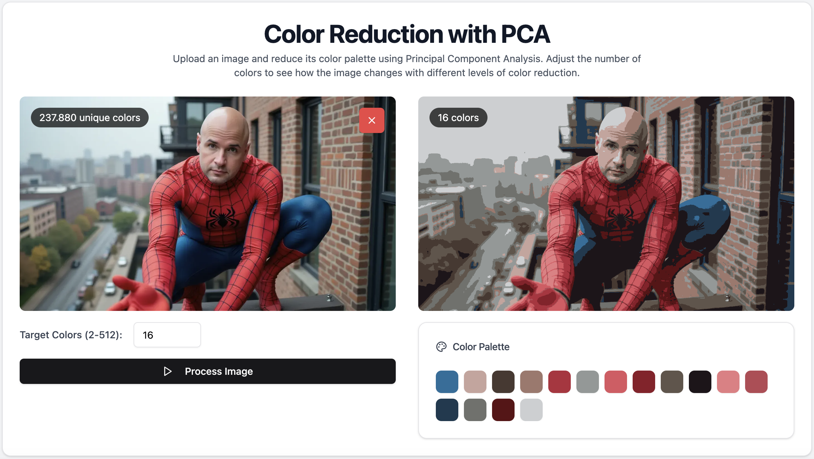

# Color Reduction with PCA

A React application that reduces the color palette of images using Principal Component Analysis (PCA) and K-means clustering algorithms.



## Features

- Upload and process images to reduce their color palette
- Adjustable number of target colors (2-512)
- Real-time progress tracking with percentage completion
- Side-by-side comparison of original and processed images
- Visual representation of the reduced color palette
- Count of unique colors in original and processed images
- Download processed images in PNG format
- Responsive design for mobile and desktop
- Dark mode support

## Tech Stack

- React 18
- TypeScript
- Vite
- Tailwind CSS
- Radix UI (for accessible components)
- Lucide React (for icons)
- Font Awesome (for social media icons)
- shadcn/ui components

## Getting Started

### Prerequisites

- Node.js (v18 or higher recommended)
- npm or yarn

### Installation

1. Clone the repository:
   ```bash
   git clone https://github.com/yourusername/color-reduction-pca.git
   ```

2. Navigate to the project directory:
   ```bash
   cd color-reduction-pca
   ```

3. Install dependencies:
   ```bash
   npm install
   # or
   yarn install
   ```

### Running the Application

1. Start the development server:
   ```bash
   npm run dev
   # or
   yarn dev
   ```

2. Open your browser and navigate to `http://localhost:5173`

## Usage

1. Click the "Upload Image" button to select an image from your computer
2. Use the slider to select the desired number of colors (2-256)
3. Click "Process Image" to start the color reduction
4. Wait for the processing to complete
5. View the results and compare the original and processed images
6. Download the processed image if desired

## Contributing

1. Fork the repository
2. Create your feature branch (`git checkout -b feature/amazing-feature`)
3. Commit your changes (`git commit -m 'Add some amazing feature'`)
4. Push to the branch (`git push origin feature/amazing-feature`)
5. Open a Pull Request

## License

This project is licensed under the MIT License - see the [LICENSE](LICENSE) file for details.

## Technical Implementation

### Color Reduction Algorithm

The application uses two main algorithms to reduce the color palette:

1. **K-means Clustering**: Groups similar colors together by:
   - Randomly selecting initial centroids
   - Assigning colors to nearest centroids
   - Recalculating centroids based on cluster means
   - Repeating until convergence or max iterations reached

2. **Principal Component Analysis (PCA)**:
   - Reduces dimensionality of color data
   - Implemented using power iteration method
   - Helps in finding main color variations

### System Requirements

- Modern web browser with WebGL support
- Sufficient RAM for processing large images
- Node.js v18 or higher
- npm v7 or higher or yarn v1.22 or higher

### Browser Compatibility

- Chrome (latest)
- Firefox (latest)
- Safari (latest)
- Edge (latest)
